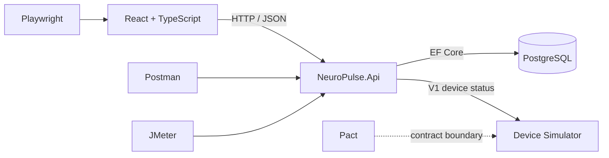

# Architecture

The monorepo intentionally contains three readable applications. The Vite React SPA presents the operational UI and proxies `/api` through nginx. The ASP.NET Core minimal API owns participants, assignments, sessions, and telemetry. EF Core maps those entities directly to PostgreSQL. Database creation and deterministic seed restoration happen at startup.

The simulator is a separately deployed ASP.NET Core process representing another team's provider. `NeuroPulse.Api` is the **consumer** of its V1 device-status representation. That HTTP boundary is the Pact exercise: selecting V2 demonstrates an independently introduced breaking change. Training configuration lives in simulator memory; resetting or restarting restores Normal.

This is deliberately not a microservice system: the external provider boundary exists because it creates useful testing lessons, while the core domain remains one service.
