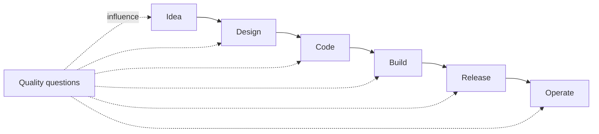
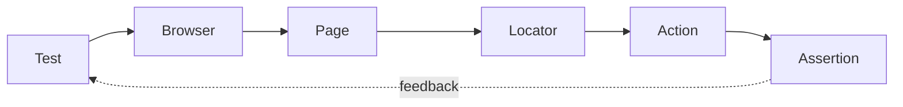
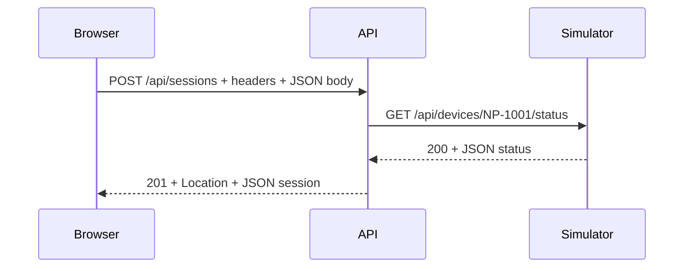
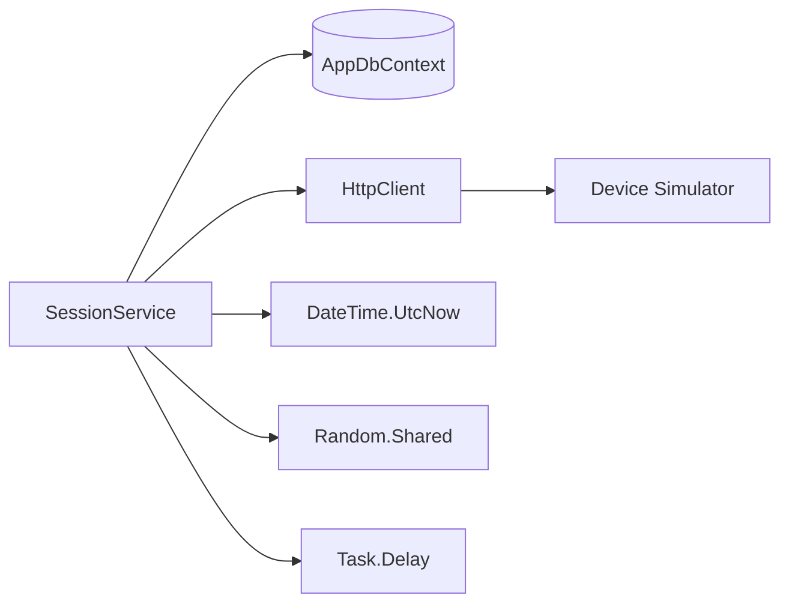
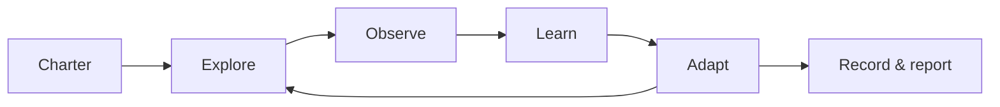

# NeuroPulse SDET Programme

**Phase 1 → Phase 2**

From testing features to engineering quality

```text
QA Engineer → Automation Engineer → SDET → Embedded Quality Advocate
```

<!--
Speaker notes:
This deck covers four 4½-hour training days. NeuroPulse is a fictional training system, not medical software. Set expectations: short concept blocks alternate with investigation, application, and reflection.
-->

---

# Phase 1 — Day 1

## From QA Engineer to SDET

**Today's question:** How do we build confidence into a feature?

<!--
Speaker notes:
Hidden timing summary: opening 15 min; teaching/discussion 76 min; activities 105 min; debriefs/close 24 min; breaks 20 min; planned total 240 min; flex 30 min.
Approximate teaching time: 3 minutes.
-->

---

# Where Are We Going?

```text
QA Engineer          Did it work?
      ↓
Automation Engineer  Can we check it repeatedly?
      ↓
SDET                 How should we build confidence?
      ↓
Quality Advocate     How can the team prevent the risk?
```

**Not:** “a tester who writes automation”

<!--
Speaker notes:
Invite learners to locate their current role without treating the sequence as a hierarchy. An SDET selects levels, diagnoses systems, improves testability, communicates risk, and coaches—not merely scripts checks.
Approximate teaching time: 5 minutes.
-->

---

# Today's Outcomes

By the end, you can:

- identify quality interventions across the SDLC;
- choose an appropriate test level;
- write a small Playwright test with an intent-focused locator;
- explain auto-waiting and test independence;
- use failure evidence to begin a diagnosis.

<!--
Speaker notes:
Today's NeuroPulse context is the Start Recording story: active participant, assigned connected device, battery at least 10%, and no active recording.
Approximate teaching time: 4 minutes.
-->

---

# The Role Is Changing

| Detection | Prevention |
|---|---|
| Test after implementation | Shape acceptance examples early |
| Report a defect | Expose an ambiguous rule |
| Add another UI check | Choose the cheapest useful signal |
| Own “the testing” | Grow team quality capability |

**Shift-left means earlier feedback—not moving every test earlier.**

<!--
Speaker notes:
Use the unspecified history rule in Assign a Device as an example of a question worth raising before implementation. Shift-left complements production observation; it does not erase monitoring or exploratory work.
Approximate teaching time: 10 minutes.
-->

---

# Quality Across the SDLC



Where could an SDET change the outcome—not just inspect it?

<!--
Speaker notes:
Discuss examples: clarify the 10% battery boundary; suggest a controllable simulator; review API semantics; create fast rules tests; add contract checks; interpret production signals. Quality is shared by product, development, operations, and testing specialists.
Approximate teaching time: 8 minutes.
-->

---

# 🛠 Activity — Quality Across the SDLC

**Purpose**

Identify where an SDET can prevent, detect, and diagnose risk.

**NeuroPulse context**

Trace a proposed change to **Start Recording** from idea through production.

**Estimated time:** 20 minutes

> Detailed activity instructions will be added later.

<!--
Instructor notes:
Learners should know the Start Recording rules. Expect a map of interventions and ownership, not a list containing “test it” at every stage. Estimated activity time: 20 minutes.
-->

---

# Debrief — Who Owns Quality?

- Where was prevention possible?
- Which feedback could arrive fastest?
- Where did specialist testing expertise add value?
- What still needs observation after release?

<!--
Speaker notes:
Resist “everyone owns quality” as the end of the conversation. Shared ownership still requires explicit responsibilities and useful quality signals.
Approximate debrief time: 6 minutes.
-->

---

# The Testing Pyramid Is a Conversation

```text
              / UI \        fewer • slower • broad confidence
             / API \
            / Integration \
           /  Unit / model  \ many • fast • isolated
```

Optimise the **feedback portfolio**, not the shape.

<!--
Speaker notes:
The pyramid is a heuristic, not a quota. Modern systems may use component tests, contract tests, and production checks. Lower tests usually isolate causes and run quickly; UI tests uniquely cover wiring and critical journeys. Risk and architecture decide the mix.
Approximate teaching time: 10 minutes.
-->

---

# Where Could “Start Recording” Live?

| Question | Candidate signal |
|---|---|
| Battery 9% is rejected | service/unit or API |
| Simulator V1 shape is understood | contract |
| Session persists correctly | integration/API |
| Technician completes the journey | focused UI |

One behaviour may justify **more than one signal**—for different risks.

<!--
Speaker notes:
Ask before revealing candidates. Discuss feedback speed, isolation, fidelity, maintenance cost, and confidence. Duplicate coverage is sometimes deliberate; accidental duplication is waste.
Approximate teaching time: 8 minutes.
-->

---

# 🛠 Activity — Where Should This Test Live?

**Purpose**

Classify risks by the most useful testing level and defend the trade-off.

**NeuroPulse context**

Participants, device assignment, recording rules, telemetry, and simulator status.

**Estimated time:** 20 minutes

> Detailed activity instructions will be added later.

<!--
Instructor notes:
Students should already understand pyramid trade-offs. Multiple defensible answers are expected when assumptions differ. Estimated activity time: 20 minutes.
-->

---

# Debrief — A Placement Checklist

1. What risk are we addressing?
2. What is the lowest level that can expose it faithfully?
3. How fast and diagnostic is the feedback?
4. What wiring remains untested?
5. Is the maintenance cost proportionate?

<!--
Speaker notes:
Use this checklist throughout the programme. “Lowest” does not mean “always unit”; fidelity to the risk matters.
Approximate debrief time: 5 minutes.
-->

---

# ☕ Break

**10 minutes**

<!-- Speaker notes: Restore the Normal scenario if the application was explored. -->

---

# Playwright: A Mental Model



**Locate intent → interact like a user → observe behaviour**

<!--
Speaker notes:
The test runner supplies fixtures such as page. A locator is a live recipe for finding an element, not a frozen element handle. Actions and web-first assertions synchronize with the page.
Approximate teaching time: 8 minutes.
-->

---

# A First NeuroPulse Test

```ts
import { test, expect } from '@playwright/test';

test('opens participants', async ({ page }) => {
  await page.goto('/participants');
  await expect(page.getByRole('heading', {
    name: 'Participants'
  })).toBeVisible();
});
```

**Arrange → Act → Assert** (even when the lines overlap)

<!--
Speaker notes:
This mirrors the repository starter test and uses the configured baseURL. Explain test, async page fixture, navigation, role locator, and web-first assertion. Do not broaden into a syntax tour.
Approximate teaching time: 10 minutes.
-->

---

# 🛠 Activity — Your First NeuroPulse Test

**Purpose**

Create one readable browser test around an observable user outcome.

**NeuroPulse context**

Use a Participants, Devices, or Sessions page from the React application.

**Estimated time:** 25 minutes

> Detailed activity instructions will be added later.

<!--
Instructor notes:
Learners need the Playwright mental model and starter project. The outcome is a small independent check, not broad journey coverage. Estimated activity time: 25 minutes.
-->

---

# What Makes a Locator Resilient?

```ts
// Volatile implementation detail
page.locator('#start-session-48372')

// User-recognisable intent
page.getByRole('button', { name: 'Start Recording' })
```

Preference guide: **role/label → text → test ID → CSS when justified**

<!--
Speaker notes:
NeuroPulse currently renders Start Recording as a clickable div with a random id, so the ideal role locator does not yet work. That is a valuable accessibility and testability finding—not a reason to select the random id. Test IDs can be appropriate where semantics cannot identify an element.
Approximate teaching time: 9 minutes.
-->

---

# Accessibility and Testability Reinforce Each Other

- A real `<button>` has role, keyboard behaviour, and focus semantics.
- A labelled input is usable by people and automation.
- Intent-focused locators survive layout and styling changes.
- A failing semantic locator may reveal a product concern.

**Would you change the test—or improve the interface?**

<!--
Speaker notes:
Avoid claiming semantic locators prove accessibility. They create useful pressure toward accessible markup, while dedicated accessibility evaluation remains necessary.
Approximate teaching time: 6 minutes.
-->

---

# 🛠 Activity — Find the Most Resilient Locator

**Purpose**

Compare selector choices and identify product testability signals.

**NeuroPulse context**

Search Participants, filter Devices, and inspect the Start Recording control.

**Estimated time:** 15 minutes

> Detailed activity instructions will be added later.

<!--
Instructor notes:
Students should distinguish semantic identity from DOM structure. Expected learning includes noticing that the clickable div constrains good locator choices. Estimated activity time: 15 minutes.
-->

---

# Waiting in an Asynchronous UI

```text
Action requested
   ↓ Playwright checks actionable state
Click / fill / navigate
   ↓ application fetches / renders
Web-first assertion retries until timeout
```

```ts
// Smell
await page.waitForTimeout(3000);

// Observe the condition that matters
await expect(page.getByRole('heading', { name: 'Participants' }))
  .toBeVisible();
```

<!--
Speaker notes:
The starter navigation test intentionally contains a three-second wait after clicking Participants, while the UI search endpoint adds only 120 ms under some conditions. Fixed waits are either wasteful or too short. Auto-waiting does not understand business completion; assert the meaningful state.
Approximate teaching time: 10 minutes.
-->

---

# 🛠 Activity — Why Is This Test Flaky?

**Purpose**

Replace timing guesses with observation of a meaningful condition.

**NeuroPulse context**

Investigate navigation or session status while simulator latency changes.

**Estimated time:** 15 minutes

> Detailed activity instructions will be added later.

<!--
Instructor notes:
Learners should understand actions and web-first assertions. Keep diagnosis focused on synchronization rather than adding retries. Estimated activity time: 15 minutes.
-->

---

# Test Independence Is Designed

Independent tests:

- establish or request known state;
- do not rely on execution order;
- own unique or resettable data;
- clean up only what they own;
- can run alone and in parallel.

**A retry can hide shared-state coupling.**

<!--
Speaker notes:
The suite is configured fullyParallel with one retry. Sarah Miller is deterministic seed data, and POST /api/training/reset restores the class state, but a global reset during parallel tests is itself dangerous. Later, fixtures and API-assisted setup will provide better patterns.
Approximate teaching time: 8 minutes.
-->

---

# ☕ Break

**10 minutes**

<!-- Speaker notes: Ask learners to preserve any useful failing evidence before resetting state. -->

---

# Debug the System, Not Just the Line

| Evidence | Useful question |
|---|---|
| Assertion message | What differed? |
| Screenshot | What was visible? |
| Trace | What actions, DOM, and network preceded it? |
| HTML report | Is failure isolated or patterned? |
| API/service logs | Did the dependency fail? |

**Failure location ≠ root cause**

<!--
Speaker notes:
The Playwright configuration captures screenshots on failure, traces on first retry, and an HTML report. Show the evidence workflow conceptually. A generic UI “Something went wrong” may require network response and API/simulator logs.
Approximate teaching time: 7 minutes.
-->

---

# 🛠 Activity — Investigate a Failed Test

**Purpose**

Build a causal hypothesis from Playwright evidence rather than guessing.

**NeuroPulse context**

Use a recording or navigation failure with report, screenshot, and trace evidence.

**Estimated time:** 10 minutes

> Detailed activity instructions will be added later.

<!--
Instructor notes:
Students should already know meaningful waits and the evidence types. Expect a supported hypothesis and next diagnostic action, not necessarily a fix. Estimated activity time: 10 minutes.
-->

---

# Day 1 Synthesis — Good SDET Questions

- What behaviour matters?
- Where should it be tested?
- How quickly can the test give feedback?
- Will the test remain reliable?
- What evidence will help us diagnose failure?

<!--
Speaker notes:
Ask each learner to choose one question they will apply at work. Preview Day 2: the browser is only one testing surface.
Approximate close time: 8 minutes.
-->

---

# Phase 1 — Day 2

## Testing Beyond the User Interface

**Today's question:** What is the browser actually talking to?

<!--
Speaker notes:
Hidden timing summary: opening/retrieval 18 min; teaching/discussion 72 min; activities 110 min; debrief/close 20 min; breaks 20 min; planned total 240 min; flex 30 min.
Approximate teaching time: 3 minutes.
-->

---

# Retrieval — What Do You Remember?

1. Where should most automated feedback live—and why?
2. What makes a locator resilient?
3. What is wrong with a fixed sleep?
4. What does test independence require?
5. Which evidence would you inspect first after a UI failure?

<!--
Speaker notes:
Use individual recall, then pair comparison. Do not present yesterday's summary first. Accept nuanced answers about the pyramid.
Approximate retrieval time: 8 minutes.
-->

---

# Today's Outcomes

By the end, you can:

- trace an HTTP request and response;
- design positive, negative, boundary, and validation API checks;
- explain why UI validation does not secure an API;
- use Postman to investigate behaviour;
- critique AI-generated test ideas and code.

<!--
Speaker notes:
Today's challenge is to test the assumptions beneath NeuroPulse's React interface using browser network tools and the ASP.NET Core API.
Approximate teaching time: 4 minutes.
-->

---

# Yesterday / Today

```text
Yesterday                        Today
Browser behaviour                System behaviour
       │                               ▲
       └── HTTP request → API → DB ────┘
                              ↘ Device Simulator
```

**A passing UI journey is one signal—not complete coverage.**

<!--
Speaker notes:
UI checks are valuable but slower, less isolated, and constrained by UI-exposed inputs. The API is both a test surface and a diagnostic boundary.
Approximate teaching time: 6 minutes.
-->

---

# HTTP for Testers



Observe: **method • URL • headers • body • status • response body**

<!--
Speaker notes:
Keep HTTP practical. Method expresses intent; URL identifies a resource; headers carry metadata; JSON is a representation; status communicates outcome. The repository's session endpoint returns 201 on creation and 400 for rejected business rules.
Approximate teaching time: 12 minutes.
-->

---

# Status Codes Are Part of the Behaviour

| Family | Meaning | NeuroPulse example |
|---|---|---|
| 2xx | request handled | `201 Created`, `202 Accepted` |
| 4xx | client/request problem | `400 Bad Request`, `404 Not Found` |
| 5xx | server/provider failure | simulator `503` |

Ask about **body and headers**, not status alone.

<!--
Speaker notes:
POST /api/telemetry returns 202 Accepted even though it currently saves before returning; treat semantics as a design discussion. Error consistency and Location headers are testable contract details.
Approximate teaching time: 6 minutes.
-->

---

# 🛠 Activity — Follow the NeuroPulse Request

**Purpose**

Connect a browser action to its HTTP request, response, and visible result.

**NeuroPulse context**

Use developer tools on participant search or Start Recording.

**Estimated time:** 15 minutes

> Detailed activity instructions will be added later.

<!--
Instructor notes:
Learners need only the HTTP mental model. Expected output is an evidence-based request/response description, not a browser-tools tutorial. Estimated activity time: 15 minutes.
-->

---

# Debrief — Follow the Evidence

- Which browser action created the request?
- Which details belonged to transport, representation, and business rules?
- What could an API test isolate?
- What could only the UI test reveal?

<!--
Speaker notes:
Emphasise complementary scopes. The API cannot prove labels or keyboard interaction; the UI is a costly place to enumerate every invalid payload.
Approximate debrief time: 5 minutes.
-->

---

# Postman: Investigation Workspace

```text
Collection   related NeuroPulse requests
Environment baseUrl = http://localhost:5000
Request      method + path + headers + body
Response     status + headers + JSON + timing
```

**Save intent and evidence—not a pile of unnamed requests.**

<!--
Speaker notes:
The repository supplies a collection grouped by primary endpoints and a local environment. Mention variables and lightweight response assertions, but avoid a user-interface tour. Postman supports exploration; maintainable automated checks still need design.
Approximate teaching time: 8 minutes.
-->

---

# 🛠 Activity — Explore the NeuroPulse API

**Purpose**

Investigate resources, filters, status codes, and JSON representations.

**NeuroPulse context**

Use the supplied collection for Participants, Devices, Sessions, or Telemetry.

**Estimated time:** 15 minutes

> Detailed activity instructions will be added later.

<!--
Instructor notes:
Students should recognise request/response components. Aim for questions and observations, not exhaustive endpoint coverage. Estimated activity time: 15 minutes.
-->

---

# ☕ Break

**10 minutes**

<!-- Speaker notes: Ensure everyone has selected the local Postman environment. -->

---

# Positive Is the Beginning

```text
Valid request works
        ↓
What assumptions can we violate?
```

- required / missing / null;
- malformed type or representation;
- just below / at / just above a boundary;
- invalid state or sequence;
- duplicate, repeated, or concurrent request.

<!--
Speaker notes:
Contrast validation rules with business-state rules. Start Recording has boundaries and state combinations. Assigning a currently assigned device raises an intentionally unspecified product question. Negative testing should be risk-driven, not random corruption.
Approximate teaching time: 10 minutes.
-->

---

# Boundary Thinking: Battery Level

Requirement: **at least 10% battery**

| Value | Expected question |
|---:|---|
| 9 | reject? |
| 10 | accept? |
| 11 | accept? |
| 0, 100 | domain edges? |
| -1, 101 | representation allowed? |
| missing, null, text | validation response? |

**Then combine with connection and session state.**

<!--
Speaker notes:
Different endpoints trust different inputs: Start consults simulator status, while device creation accepts a battery value directly. This helps distinguish business rules from input validation and exposes missing guards without naming instructor-only defects.
Approximate teaching time: 8 minutes.
-->

---

# 🛠 Activity — Break the API

**Purpose**

Design targeted negative and boundary tests with explicit expected outcomes.

**NeuroPulse context**

Probe participant creation, assignment, session start, or telemetry input.

**Estimated time:** 20 minutes

> Detailed activity instructions will be added later.

<!--
Instructor notes:
Students need positive requests and boundary categories. Reward precise hypotheses and risk selection rather than request count. Estimated activity time: 20 minutes.
-->

---

# UI Validation ≠ System Protection

```text
React form: type="email" + required
             │
             ├── helps a normal user
             └── can be bypassed

Direct client ───────────────→ POST /api/participants
```

**If React refuses a value, has the API protected itself?**

<!--
Speaker notes:
The participant form declares required fields and email type. The API constructs and saves ParticipantRequest values without an explicit validation layer. Let learners investigate rather than announcing a defect. Client validation improves experience; authoritative validation belongs at the trust boundary.
Approximate teaching time: 8 minutes.
-->

---

# 🛠 Activity — The UI Said No; What Does the API Say?

**Purpose**

Compare client-side constraints with direct API behaviour.

**NeuroPulse context**

Use participant email/required fields or session business-state rules.

**Estimated time:** 15 minutes

> Detailed activity instructions will be added later.

<!--
Instructor notes:
Students should be able to reproduce a valid request before modifying it. Expected learning is placement of validation and clear evidence, not merely “found a bug.” Estimated activity time: 15 minutes.
-->

---

# Debrief — Validation Has Layers

| Layer | Primary value |
|---|---|
| UI | immediate guidance and accessibility |
| API | protects the trust boundary |
| Domain/service | preserves business invariants |
| Database | last-line integrity constraints |

**Consistency matters; identical implementation does not.**

<!--
Speaker notes:
Discuss error quality, duplicated rules, and defence in depth. Tests should target the responsibility of each layer rather than repeat the same end-to-end scenario everywhere.
Approximate debrief time: 5 minutes.
-->

---

# ☕ Break

**10 minutes**

<!-- Speaker notes: Reset class data if negative requests changed shared records. -->

---

# AI-Enabled Testing: Useful Roles

```text
Assistant • accelerator • idea generator • reviewer
```

- expand candidate boundaries;
- challenge requirement assumptions;
- draft a test or data builder;
- explain an unfamiliar failure;
- spot duplication and review readability.

**Human judgement selects, verifies, and owns the result.**

<!--
Speaker notes:
Ask where learners already use AI. AI can broaden and accelerate reasoning when supplied with relevant context. It cannot observe an unstated truth or assume accountability.
Approximate teaching time: 8 minutes.
-->

---

# The Risk Ledger

| Risk | Countermeasure |
|---|---|
| hallucinated endpoint/API | verify against code or OpenAPI |
| invented requirement | label assumptions; ask product |
| shallow happy paths | add risk and boundary context |
| insecure data sharing | use approved tools and synthetic data |
| plausible broken code | run, review, and simplify |
| false confidence | demand evidence |

**Generated ≠ correct**

<!--
Speaker notes:
NeuroPulse data is fictional, but workplace policy still matters. Discuss prompt injection and proprietary data only to a practical depth. The same review standard applies regardless of authorship.
Approximate teaching time: 8 minutes.
-->

---

# 🛠 Activity — Ask AI to Test This

**Purpose**

Compare human test design with AI-generated candidates and improve the prompt.

**NeuroPulse context**

Use the Start Recording or Assign a Device user story.

**Estimated time:** 20 minutes

> Detailed activity instructions will be added later.

<!--
Instructor notes:
Students should first record their own risks so AI does not anchor the exercise. Expected learning is evaluation and prompt iteration, not maximum idea count. Estimated activity time: 20 minutes.
-->

---

# Would You Merge This?

```ts
await page.locator('#start-session-48372').click();
await page.waitForTimeout(5000);
expect(await page.locator('.badge').innerText()).toBe('Recording');
```

Review for:

**intent • truth • synchronization • isolation • diagnostics • maintainability**

<!--
Speaker notes:
The snippet looks plausible but uses a random id, arbitrary delay, broad badge locator, non-web-first assertion, and unspecified setup. Ask what evidence would establish correctness and whether the product markup should change.
Approximate teaching time: 6 minutes.
-->

---

# 🛠 Activity — Would You Merge This AI-Generated Test?

**Purpose**

Apply normal code-review and test-design standards to generated work.

**NeuroPulse context**

Critique a candidate recording-session or API validation test.

**Estimated time:** 15 minutes

> Detailed activity instructions will be added later.

<!--
Instructor notes:
Learners need the AI risk ledger and Day 1 Playwright principles. Expected outcome is a review with prioritised changes and verification steps. Estimated activity time: 15 minutes.
-->

---

# Phase 1 Assessment — The Shape

You will combine:

- a reasoned test strategy;
- focused Playwright coverage;
- API investigation and negative testing;
- clear risk communication;
- transparent, appropriate AI use.

**Assessment rewards decisions and evidence—not test count.**

<!--
Speaker notes:
Introduce only the capability areas and evidence expectations. Detailed assessment instructions will be created separately.
Approximate teaching time: 4 minutes.
-->

---

# 🛠 Activity — Phase 1 Assessment Preparation

**Purpose**

Identify evidence needed to demonstrate Phase 1 capability.

**NeuroPulse context**

A bounded participant, device, session, or telemetry quality risk.

**Estimated time:** 10 minutes

> Detailed activity instructions will be added later.

<!--
Instructor notes:
Students should understand that strategy, UI/API technique, reasoning, and responsible AI use will be combined. Do not reveal a detailed assessment scenario. Estimated activity time: 10 minutes.
-->

---

# Day 2 Reflection

- Which risk moved below the UI today?
- Which API assumption needs clarification?
- Which AI suggestion survived verification?
- What quality decision can you now defend?

<!--
Speaker notes:
Close Phase 1 by returning to the role progression: learners can now select and use multiple test surfaces, not only automate a browser journey.
Approximate close time: 6 minutes.
-->

---

# Phase 2 — Day 1

## Engineering an Automation Strategy

**Today's question:** Can we maintain this automation six months from now?

<!--
Speaker notes:
Hidden timing summary: opening/retrieval 15 min; teaching/discussion 88 min; activities 100 min; debrief/close 17 min; breaks 20 min; planned total 240 min; flex 30 min.
Approximate teaching time: 3 minutes.
-->

---

# Retrieval — Beyond “Can We Automate It?”

- Which test level would expose a 9% battery rule fastest?
- Why can a UI constraint differ from API protection?
- What makes an automated check independent?
- When should AI-generated code be trusted?

**New question:** What happens when three tests become three hundred?

<!--
Speaker notes:
Use silent recall followed by group comparison. Connect Phase 1 placement decisions to suite architecture.
Approximate retrieval time: 7 minutes.
-->

---

# Today's Outcomes

By the end, you can:

- organise setup and fixtures around isolation;
- judge whether a Page Object earns its cost;
- diagnose likely sources of flakiness;
- explain and sketch a consumer contract;
- distinguish performance test types and interpret percentiles.

<!--
Speaker notes:
Today's NeuroPulse challenge spans the growing Playwright suite, the API-to-simulator boundary, and telemetry ingestion under load.
Approximate teaching time: 5 minutes.
-->

---

# From Tests to a Suite

```text
One test                  A suite
works once                runs repeatedly
known state               shared and parallel state
local readability         discoverable organisation
simple setup              data lifecycle
single failure            failure patterns
```

Watch for **duplication • order dependence • slow UI setup • leaky abstractions**.

<!--
Speaker notes:
The current Playwright suite has three compact starters, fully parallel execution, and retry enabled. Growing it without a data and abstraction strategy will amplify coupling.
Approximate teaching time: 8 minutes.
-->

---

# 🛠 Activity — Review the Growing NeuroPulse Suite

**Purpose**

Identify maintainability, speed, data, and diagnostic risks in a suite design.

**NeuroPulse context**

Extend the starter Participants/navigation/session examples conceptually.

**Estimated time:** 15 minutes

> Detailed activity instructions will be added later.

<!--
Instructor notes:
Students should bring Phase 1 principles of placement and independence. Expect prioritised risks, not immediate refactoring. Estimated activity time: 15 minutes.
-->

---

# Setup Is Part of Test Design

| Need | Better question |
|---|---|
| known participant | seed, builder, or API creation? |
| assigned device | direct setup or behaviour under test? |
| normal simulator | who owns reset? |
| cleanup | can data be unique/idempotent? |

**Use the UI to test UI behaviour—not merely to transport setup.**

<!--
Speaker notes:
Define setup/teardown and idempotency. POST /api/training/reset is convenient for a class but hazardous if tests reset shared state in parallel. API-assisted setup is faster but must not bypass the behaviour being tested.
Approximate teaching time: 10 minutes.
-->

---

# Fixtures: Reusable Context, Explicit Ownership

```ts
type NPFixtures = { participant: Participant };

const test = base.extend<NPFixtures>({
  participant: async ({ request }, use) => {
    const participant = await createParticipant(request);
    await use(participant);
    // remove only data this fixture owns
  }
});
```

**Fixture scope should match resource lifetime.**

<!--
Speaker notes:
This is a conceptual candidate, not code copied from the repo; the current API has no delete endpoint, which affects cleanup strategy. Explain test- versus worker-scoped lifetime and transparent dependencies without teaching the full fixture API.
Approximate teaching time: 10 minutes.
-->

---

# 🛠 Activity — Remove the Repeated Setup

**Purpose**

Refactor repeated UI preparation into an explicit, isolated setup strategy.

**NeuroPulse context**

Prepare participant/device/session state using fixtures and appropriate API calls.

**Estimated time:** 15 minutes

> Detailed activity instructions will be added later.

<!--
Instructor notes:
Students should understand resource ownership and why global resets conflict with parallelism. Expected outcome is a design or small refactor, not a complete framework. Estimated activity time: 15 minutes.
-->

---

# Page Objects: What Problem Are We Solving?

**They can:**

- name stable user interactions;
- centralise repeated locator knowledge;
- reduce irrelevant detail in tests.

**They can also:**

- become giant “god pages”;
- hide assertions and control flow;
- mirror the DOM instead of the domain.

<!--
Speaker notes:
Do not mandate Page Objects. Prefer the smallest abstraction that removes meaningful duplication. Component objects, helper functions, and fixtures may solve different problems.
Approximate teaching time: 8 minutes.
-->

---

# 🛠 Activity — Should This Become a Page Object?

**Purpose**

Choose an abstraction based on change patterns and readability, not convention.

**NeuroPulse context**

Compare Participants filters, shared navigation, and the recording workflow.

**Estimated time:** 10 minutes

> Detailed activity instructions will be added later.

<!--
Instructor notes:
Students should know setup and fixture responsibilities. Different abstractions may be defensible; require a named problem and trade-off. Estimated activity time: 10 minutes.
-->

---

# ☕ Break

**10 minutes**

<!-- Speaker notes: Preserve review notes for the post-break flakiness discussion. -->

---

# Flakiness Is a Symptom

```text
Timing | State | Data | Environment | Dependency | Concurrency
```

```text
Retry passes → information about instability
Retry hides   → unresolved risk
```

**Classify → reproduce → gather evidence → isolate → fix cause**

<!--
Speaker notes:
Use the navigation fixed wait, simulator intermittent failures, random session values, and duplicate-submission delay as categories. Retries can protect a pipeline from transient infrastructure, but repeated green is not proof of deterministic product behaviour.
Approximate teaching time: 10 minutes.
-->

---

# Asynchronous Failure: Ask What Completed

- Was the element actionable?
- Did the request leave the browser?
- Did the API complete or time out?
- Did the simulator return V1, V2, or 503?
- Did the UI render the newest state?
- Did another test mutate shared data?

**Wait for an observable condition; never wait “just in case.”**

<!--
Speaker notes:
The Slow Device Network preset adds 3000 ms simulator latency; Unreliable Device adds intermittent delay and random 503s. Separate expected asynchronous work from nondeterministic failure.
Approximate teaching time: 7 minutes.
-->

---

# 🛠 Activity — Find the Source of the Flake

**Purpose**

Classify intermittent failure and propose evidence that distinguishes causes.

**NeuroPulse context**

Use latency, unreliable-device controls, parallel state, or the starter fixed wait.

**Estimated time:** 15 minutes

> Detailed activity instructions will be added later.

<!--
Instructor notes:
Learners should diagnose before changing timeouts or retry counts. Expected output is a causal hypothesis, discriminating evidence, and proportionate fix. Estimated activity time: 15 minutes.
-->

---

# AI as Pair Tester—not Autopilot

Provide bounded evidence:

```text
test + assertion message + trace excerpt + request timeline
```

Ask for:

1. ranked hypotheses;
2. evidence for/against each;
3. next diagnostic action;
4. smallest safe refactor.

<!--
Speaker notes:
AI is more useful for structured analysis than “fix this flaky test.” Remove secrets and sensitive data. Verify suggested Playwright APIs against the installed version and run every change.
Approximate teaching time: 6 minutes.
-->

---

# 🛠 Activity — AI as Pair Tester

**Purpose**

Use AI to analyse evidence or duplication while retaining engineering judgement.

**NeuroPulse context**

Review a failure trace, fixed wait, or repeated suite setup.

**Estimated time:** 10 minutes

> Detailed activity instructions will be added later.

<!--
Instructor notes:
Students should apply the Phase 1 AI risk ledger. Expect verification of proposals and explicit rejection of unsupported claims. Estimated activity time: 10 minutes.
-->

---

# The Contract Problem

```text
NeuroPulse.Api (consumer) → Device Simulator (provider)

Provider changes independently
Provider tests pass
Consumer breaks

Who had the failing test?
```

<!--
Speaker notes:
Start with coordination risk, not tooling. NeuroPulse calls GET /api/devices/{serial}/status and expects the V1 fields deviceId, connected, and battery. The simulator represents another team's independently deployed service.
Approximate teaching time: 7 minutes.
-->

---

# Consumer Contract + Provider Verification


A useful contract captures **what the consumer actually depends on**—no more.

<!--
Speaker notes:
Pact records consumer interactions and verifies them against the provider. It complements, rather than replaces, provider tests and a small number of integrated checks. Mocking alone shows the consumer works with its own mock; provider verification closes the loop.
Approximate teaching time: 10 minutes.
-->

---

# 🛠 Activity — What Does NeuroPulse Actually Depend On?

**Purpose**

Identify the smallest meaningful consumer expectation at a service boundary.

**NeuroPulse context**

Model the API consumer's V1 device-status interaction with the simulator.

**Estimated time:** 10 minutes

> Detailed activity instructions will be added later.

<!--
Instructor notes:
Students need consumer/provider vocabulary, not Pact implementation mastery. Avoid over-specifying irrelevant provider fields. Estimated activity time: 10 minutes.
-->

---

# V1 → V2: Compatible or Breaking?

```json
// V1
{ "deviceId": "NP-1001", "connected": true, "battery": 87 }

// V2
{ "id": "NP-1001", "status": "ONLINE", "batteryPercent": 87 }
```

Provider correctness does not imply **consumer compatibility**.

<!--
Speaker notes:
These are the simulator's actual conceptual shapes. Ask which consumer assumptions break and how a migration could be coordinated. The Training Control Panel can switch Contract Breaking Change/V2.
Approximate teaching time: 6 minutes.
-->

---

# 🛠 Activity — Catch the Breaking Change

**Purpose**

Predict and expose an independently introduced contract incompatibility.

**NeuroPulse context**

Compare simulator V1 with the Contract Breaking Change scenario (V2).

**Estimated time:** 10 minutes

> Detailed activity instructions will be added later.

<!--
Instructor notes:
Students should already state the consumer dependency. Detailed Pact implementation will be added later; focus on what should fail and why. Estimated activity time: 10 minutes.
-->

---

# ☕ Break

**10 minutes**

<!-- Speaker notes: Return the simulator contract to V1/Normal before performance work. -->

---

# Functional Correctness Is Not Enough

| Signal | Question |
|---|---|
| latency | how long does a request take? |
| throughput | how much work completes per unit time? |
| concurrency | how many users/requests overlap? |
| error rate | what proportion fails? |

**A target needs workload + environment + threshold + duration.**

<!--
Speaker notes:
Avoid declaring a response “fast” without a user or system objective. NeuroPulse's telemetry endpoint is a useful narrow target; database and simulator configuration influence results.
Approximate teaching time: 8 minutes.
-->

---

# Load, Stress, Spike, Endurance

```text
Load       expected demand → does it meet objectives?
Stress     beyond capacity → where/how does it degrade?
Spike      sudden change   → does it absorb and recover?
Endurance  sustained load  → does it deteriorate over time?
```

Choose the test that answers the risk question.

<!--
Speaker notes:
Terminology varies slightly across organisations; focus on intent. Mention recovery and resource observation. Do not turn this into full performance engineering.
Approximate teaching time: 6 minutes.
-->

---

# Why the Average Can Lie

```text
95 requests × 100 ms
 5 requests × 5,000 ms

Average: 345 ms
p95: around the boundary where the slow tail begins
p99: exposes the tail
```

**Percentile:** X% of observations completed at or below this value.

<!--
Speaker notes:
Explain p95 intuitively and note that small samples make tail percentiles unstable. Interpret latency alongside throughput and errors; a fast failed response is not success.
Approximate teaching time: 8 minutes.
-->

---

# JMeter: Small Mental Model

```text
Thread Group   virtual users + ramp + loops
Sampler        POST /api/telemetry
Headers/body   JSON request
Results        latency + throughput + errors
```

The scaffold starts safely: **1 user × 5 iterations**.

<!--
Speaker notes:
The supplied telemetry-smoke.jmx posts to localhost:5000 and uses a fixed session id. Discuss test data validity and non-GUI execution. The Performance Stress scenario adds a small telemetry delay; results need a controlled baseline.
Approximate teaching time: 6 minutes.
-->

---

# 🛠 Activity — How Does NeuroPulse Behave Under Load?

**Purpose**

Compare a safe baseline with changed load or simulator conditions and interpret signals.

**NeuroPulse context**

Use the telemetry JMeter plan and Performance Stress scenario.

**Estimated time:** 15 minutes

> Detailed activity instructions will be added later.

<!--
Instructor notes:
Students need latency/throughput/error and percentile concepts. Keep concurrency safe; expect interpretation and limitations, not a benchmark claim. Estimated activity time: 15 minutes.
-->

---

# Day 1 Strategy Check

- Does suite structure preserve intent and isolation?
- Is abstraction paying for itself?
- Did we diagnose rather than retry the flake?
- Does a contract protect the real dependency?
- Does performance evidence answer a stated risk?

<!--
Speaker notes:
Ask for one automation-strategy change each group would recommend and the trade-off it introduces. Preview tomorrow: sometimes the strongest testing improvement is a software design change.
Approximate close time: 7 minutes.
-->

---

# Phase 2 — Day 2

## The SDET as a Quality Advocate

**Opening question:** What if the best way to improve testing is to change the software?

<!--
Speaker notes:
Hidden timing summary: opening/retrieval 16 min; teaching/discussion 84 min; activities 100 min; debrief/close 20 min; breaks 20 min; planned total 240 min; flex 30 min.
Approximate teaching time: 3 minutes.
-->

---

# Retrieval — Engineering the Signal

- When does a fixture improve independence?
- What problem should a Page Object solve?
- Why is a retry not a flake fix?
- What does the NeuroPulse consumer expect from the simulator?
- Why might p95 matter more than an average?

<!--
Speaker notes:
Use recall before discussion. Link maintainable tests, contracts, and performance signals to the wider question of testable design.
Approximate retrieval time: 7 minutes.
-->

---

# Today's Outcomes

By the end, you can:

- recognise observable, controllable, deterministic design;
- propose a seam for time, randomness, or an external service;
- coach a developer through quality-focused review;
- create and execute a structured exploratory charter;
- communicate a quality risk with evidence and impact.

<!--
Speaker notes:
Today's NeuroPulse challenge uses SessionService dependencies, UI review examples, and unreliable simulator presets.
Approximate teaching time: 4 minutes.
-->

---

# Testability Is a Design Property

```text
Observable      Can we see outcomes and useful diagnostics?
Controllable    Can we establish relevant state?
Deterministic   Can the same conditions produce a stable result?
Isolated        Can we locate the cause?
Replaceable     Can dependencies be substituted at the right level?
```

**Testability improves development feedback—not only test code.**

<!--
Speaker notes:
Observability includes state, logs, metrics, and meaningful errors—not exposing internals indiscriminately. Test seams should improve control while preserving realistic integrated checks where dependency behaviour is the risk.
Approximate teaching time: 10 minutes.
-->

---

# A NeuroPulse Dependency Map



Which dependency controls the test—and which does the test control?

<!--
Speaker notes:
This reflects the real SessionService: database and HttpClient are injected, while concrete time, randomness, and an 80 ms delay are used directly. Dependency injection exists, but testability is not binary.
Approximate teaching time: 8 minutes.
-->

---

# 🛠 Activity — What Makes This Difficult to Test?

**Purpose**

Identify controllability, observability, determinism, and isolation constraints.

**NeuroPulse context**

Review `SessionService` and its database, HTTP, clock, random, and delay dependencies.

**Estimated time:** 15 minutes

> Detailed activity instructions will be added later.

<!--
Instructor notes:
Students need the testability characteristics and dependency map. Expected output is a risk-ranked analysis, not an instruction to mock everything. Estimated activity time: 15 minutes.
-->

---

# Time Is an Input

```csharp
// Hard to control
session.StartedAt = DateTime.UtcNow;

// Design question
session.StartedAt = clock.UtcNow;
```

How do we test **tomorrow**, a boundary instant, or elapsed duration?

<!--
Speaker notes:
Introduce a controllable clock conceptually. A real clock remains appropriate in some integrated tests. The seam helps fast rule tests, avoids narrow timing assertions, and makes failures reproducible.
Approximate teaching time: 7 minutes.
-->

---

# Randomness Is Also an Input

```csharp
// Session summary and simulator telemetry vary
Random.Shared.Next(55, 90)
Random.Shared.NextDouble()

// Options
seeded generator • injected source • predetermined sequence
```

**Random production behaviour can coexist with deterministic tests.**

<!--
Speaker notes:
NeuroPulse session signal values and simulator telemetry are random. Discuss when property-based/randomized testing is deliberate and records its seed versus uncontrolled randomness that makes expected values and reproduction difficult.
Approximate teaching time: 7 minutes.
-->

---

# External Dependencies and Test Seams

| Dependency | Possible seam | Keep a real check for… |
|---|---|---|
| Device Simulator | HTTP fake/contract | compatibility and network behaviour |
| PostgreSQL | repository/context boundary | mapping, constraints, queries |
| clock/random | injected source | system integration/configuration |
| filesystem/queue | adapter/interface | protocol and operational behaviour |

**Mocking increases control; reality increases fidelity. Use both deliberately.**

<!--
Speaker notes:
A seam is a place where behaviour can be observed or substituted. Avoid interfaces created solely by habit. Contract, integration, and end-to-end checks retain confidence that controlled doubles cannot provide.
Approximate teaching time: 8 minutes.
-->

---

# 🛠 Activity — Make the Behaviour Testable

**Purpose**

Propose a small seam that makes one important behaviour deterministic.

**NeuroPulse context**

Use session timestamps, generated signal quality, simulator status, or duplicate timing.

**Estimated time:** 20 minutes

> Detailed activity instructions will be added later.

<!--
Instructor notes:
Learners should choose a specific behaviour and smallest useful design change. Require a statement of what remains covered by a real-dependency test. Estimated activity time: 20 minutes.
-->

---

# Debrief — A Seam Has a Cost

- Which test became simpler or faster?
- Which production design changed?
- Did the seam expose intent or add indirection?
- What real integration still needs coverage?
- Could observability solve part of the problem instead?

<!--
Speaker notes:
Avoid “inject everything” as the answer. Good seams align with meaningful concepts and likely change boundaries.
Approximate debrief time: 5 minutes.
-->

---

# ☕ Break

**10 minutes**

<!-- Speaker notes: Transition from technical seams to collaborative influence. -->

---

# Gatekeeper or Quality Coach?

| Gatekeeper | Quality coach |
|---|---|
| “This code is wrong.” | “Which failure matters most here?” |
| blocks at the end | collaborates while options are open |
| owns the verdict | builds shared ownership |
| prescribes a framework | asks what makes behaviour verifiable |

**Coaching is not lowering standards; it improves how standards are achieved.**

<!--
Speaker notes:
SDETs still report serious risks and may recommend blocking release. The distinction is stance: evidence, curiosity, constraints, and shared problem-solving rather than unilateral ownership of quality.
Approximate teaching time: 8 minutes.
-->

---

# 🛠 Activity — Coach the Developer

**Purpose**

Practise converting a testability concern into constructive questions and options.

**NeuroPulse context**

Use the clickable Start Recording div, fixed wait, generic error, or SessionService dependency.

**Estimated time:** 15 minutes

> Detailed activity instructions will be added later.

<!--
Instructor notes:
Students should identify evidence, impact, and developer constraints before role-play. Expected outcome is shared problem framing, not winning an argument. Estimated activity time: 15 minutes.
-->

---

# Quality-Focused Code Review

Ask:

- Can I observe the result and the failure?
- Can I control important dependencies?
- What assumptions are hidden?
- What happens concurrently or on repetition?
- Can this be tested below the UI?
- Does the code preserve domain invariants?

<!--
Speaker notes:
Review the risk, not merely style. In NeuroPulse, duplicate session starts, reassignment, generic error handling, and random element ids provide discussion points without telling learners which are deliberate exercises.
Approximate teaching time: 7 minutes.
-->

---

# 🛠 Activity — Review This Pull Request

**Purpose**

Write prioritised, evidence-based review comments that improve quality and testability.

**NeuroPulse context**

Review a small change around session start, device assignment, or error presentation.

**Estimated time:** 15 minutes

> Detailed activity instructions will be added later.

<!--
Instructor notes:
Students need the review questions and coaching stance. Expect proportionate comments that separate must-fix risk from optional improvement. Estimated activity time: 15 minutes.
-->

---

# ☕ Break

**10 minutes**

<!-- Speaker notes: Apply the Exploratory Testing preset only when the next activity is ready. -->

---

# Exploratory Testing Is Structured Engineering

**Not:** clicking around randomly



Test design and execution happen together.

<!--
Speaker notes:
Scripted checks confirm specified examples efficiently; exploration investigates uncertainty and adapts from observations. Both are valuable. Timeboxes, charters, notes, and evidence make exploratory work accountable.
Approximate teaching time: 8 minutes.
-->

---

# A Useful Charter

```text
Explore: recording-session behaviour
With: unreliable connectivity and repeated actions
To discover: stale state, unsafe transitions, and recovery risks
Timebox: 25 minutes
Evidence: timeline, requests, screenshots, concise notes
```

**Specific enough to focus; open enough to learn.**

<!--
Speaker notes:
Distinguish mission from procedure. A charter names scope, variables, risk, and evidence without prescribing every click.
Approximate teaching time: 6 minutes.
-->

---

# Small Heuristic Set

Vary and observe:

```text
Boundaries     Interruptions     State changes
Repetition     Invalid sequence  Concurrency
Time           Failure           Recovery
```

Heuristics generate questions; they do not guarantee coverage.

<!--
Speaker notes:
Apply one or two examples: disconnect during recording, repeat Start quickly, recover from simulator 503, observe status freshness. Avoid overwhelming learners with acronym catalogues.
Approximate teaching time: 6 minutes.
-->

---

# 🛠 Activity — Explore an Unreliable NeuroPulse Device

**Purpose**

Run a focused exploratory session, adapt from observations, and capture evidence.

**NeuroPulse context**

Use the Unreliable Device or Exploratory Testing Training Control Panel preset.

**Estimated time:** 25 minutes

> Detailed activity instructions will be added later.

<!--
Instructor notes:
Students need a charter, a small heuristic set, and note-taking expectations. Restore Normal afterward. Expected outcome includes observations and new questions, not only confirmed defects. Estimated activity time: 25 minutes.
-->

---

# Debrief — What Changed Your Investigation?

- Which observation changed your next action?
- Which notes preserve sequence and state?
- What did you learn that a script might miss?
- Which finding should become an automated check?
- Which uncertainty remains?

<!--
Speaker notes:
Ask groups to distinguish observations, inferences, and confirmed results. This is the core adaptive skill of exploratory work.
Approximate debrief time: 6 minutes.
-->

---

# Communicate a Risk, Not “It Broke”

```text
Condition: connectivity drops during an active recording
Observation: UI continues to show Connected for ~X seconds
Impact: technician may attempt an invalid action
Evidence: timeline + request/response + screenshot/trace
Reproduction: environment, data, sequence, frequency
Uncertainty: what is not yet known
```

<!--
Speaker notes:
X is deliberately an observed value, not a promised defect. Strong reports separate fact from inference, describe user/business impact, and provide sufficient evidence without overstating certainty.
Approximate teaching time: 7 minutes.
-->

---

# Quality Signals or Vanity Metrics?

| Count | Better question |
|---|---|
| number of tests | what risks receive timely feedback? |
| pass rate | are failures trusted and diagnostic? |
| defects found | what escaped, recurred, or was prevented? |
| automation % | is the feedback portfolio effective? |

**Metrics should change a decision.**

<!--
Speaker notes:
Connect communication to strategy. Counts can provide context, but targets invite gaming. Prefer trends and decision-oriented signals such as detection latency, flaky-test rate, escaped risk patterns, and recovery evidence.
Approximate teaching time: 5 minutes.
-->

---

# Phase 2 Assessment — The Shape

You will need to:

- analyse a quality problem and choose test levels;
- automate appropriate behaviour and investigate APIs;
- consider contract and performance risks;
- identify a testability improvement;
- communicate evidence and recommendations.

<!--
Speaker notes:
Present capability coverage, not detailed assessment tasks. Responsible AI use remains transparent and subject to the same review standard.
Approximate teaching time: 4 minutes.
-->

---

# 🛠 Activity — Phase 2 Assessment Preparation

**Purpose**

Plan how evidence could demonstrate integrated SDET capability.

**NeuroPulse context**

A bounded quality problem crossing UI, API, simulator, persistence, or telemetry.

**Estimated time:** 10 minutes

> Detailed activity instructions will be added later.

<!--
Instructor notes:
Students should identify possible evidence and decision points without receiving the eventual assessment procedure. Estimated activity time: 10 minutes.
-->

---

# Programme Transition

```text
Phase 1  I can test the system.
Phase 2  I can engineer quality into the system.
Phase 3  I can design and defend a quality approach.
```

For the hackathon/showcase, bring:

- a risk-based argument;
- evidence from appropriate levels;
- a testable, maintainable approach;
- honest limitations and trade-offs.

<!--
Speaker notes:
Close by returning to the progression toward embedded quality advocacy. The later showcase should value judgement, collaboration, diagnosis, and communication alongside working automation.
Approximate close time: 8 minutes.
-->

---

# Instructor Planning Index

> **Instructor-only planning material — do not convert this section into presentation slides.**

## Phase 1 — Day 1: From QA Engineer to SDET

| Section | Concept | Approx. explanation time | Activity placeholder | Approx. activity time | NeuroPulse feature involved |
|---|---|---:|---|---:|---|
| Opening | role progression and outcomes | 12 min | — | — | Start Recording story |
| Quality across SDLC | shift-left, prevention, shared ownership | 18 min | Quality Across the SDLC | 20 min | recording feature lifecycle |
| Test placement | pyramid as heuristic, feedback portfolio | 18 min | Where Should This Test Live? | 20 min | participant/device/session rules |
| Playwright foundation | browser-page-locator-action-assertion | 18 min | Your First NeuroPulse Test | 25 min | Participants/Devices/Sessions |
| Locators | semantics, resilience, accessibility | 15 min | Find the Most Resilient Locator | 15 min | filters and Start Recording |
| Async and isolation | auto-waiting, state, independence | 18 min | Why Is This Test Flaky? | 15 min | navigation/simulator latency |
| Failure diagnosis | traces, screenshots, reports | 7 min | Investigate a Failed Test | 10 min | recording/navigation failure |
| Close/debriefs | retrieval and synthesis | 9 min | — | — | cross-feature reflection |

| Day totals | Time |
|---|---:|
| Planned teaching/opening/debrief time | 115 min |
| Planned activity time | 105 min |
| Break time | 20 min |
| **Planned total** | **240 min** |
| **Unallocated/flex time** | **30 min** |

## Phase 1 — Day 2: Testing Beyond the User Interface

| Section | Concept | Approx. explanation time | Activity placeholder | Approx. activity time | NeuroPulse feature involved |
|---|---|---:|---|---:|---|
| Opening | retrieval, browser-to-API transition | 15 min | — | — | React/API architecture |
| HTTP mental model | requests, responses, status semantics | 18 min | Follow the NeuroPulse Request | 15 min | search or session start |
| Postman | collection/environment investigation | 8 min | Explore the NeuroPulse API | 15 min | primary REST endpoints |
| Negative design | invalid data/state, boundaries | 18 min | Break the API | 20 min | battery/session/telemetry |
| Validation layers | UI versus trust boundary | 13 min | The UI Said No; What Does the API Say? | 15 min | participant/session validation |
| AI-enabled testing | uses, risks, evaluation | 22 min | Ask AI to Test This | 20 min | user stories/OpenAPI |
| Generated-code review | Generated ≠ Correct | 6 min | Would You Merge This AI-Generated Test? | 15 min | recording test |
| Assessment/close | Phase 1 evidence and reflection | 10 min | Phase 1 Assessment Preparation | 10 min | bounded system risk |

| Day totals | Time |
|---|---:|
| Planned teaching/opening/debrief time | 110 min |
| Planned activity time | 110 min |
| Break time | 20 min |
| **Planned total** | **240 min** |
| **Unallocated/flex time** | **30 min** |

## Phase 2 — Day 1: Engineering an Automation Strategy

| Section | Concept | Approx. explanation time | Activity placeholder | Approx. activity time | NeuroPulse feature involved |
|---|---|---:|---|---:|---|
| Opening | retrieval and suite-quality outcomes | 12 min | — | — | all test scaffolds |
| Suite maintainability | duplication, organisation, state | 8 min | Review the Growing NeuroPulse Suite | 15 min | Playwright starters |
| Setup and fixtures | isolation, API setup, test data | 20 min | Remove the Repeated Setup | 15 min | participants/devices/sessions |
| Abstraction | Page Objects and alternatives | 8 min | Should This Become a Page Object? | 10 min | navigation/filters/recording |
| Flakiness | timing, state, dependencies, evidence | 17 min | Find the Source of the Flake | 15 min | latency/unreliable controls |
| AI in automation | failure analysis and refactoring | 6 min | AI as Pair Tester | 10 min | trace/fixed wait/setup |
| Contract testing | consumer, provider, Pact, breaking V2 | 18 min | What Does NeuroPulse Actually Depend On? / Catch the Breaking Change | 20 min | API → Device Simulator |
| Performance | workload types, metrics, percentiles, JMeter | 23 min | How Does NeuroPulse Behave Under Load? | 15 min | POST telemetry |
| Close/debriefs | strategy synthesis | 8 min | — | — | cross-suite decisions |

| Day totals | Time |
|---|---:|
| Planned teaching/opening/debrief time | 120 min |
| Planned activity time | 100 min |
| Break time | 20 min |
| **Planned total** | **240 min** |
| **Unallocated/flex time** | **30 min** |

## Phase 2 — Day 2: The SDET as a Quality Advocate

| Section | Concept | Approx. explanation time | Activity placeholder | Approx. activity time | NeuroPulse feature involved |
|---|---|---:|---|---:|---|
| Opening | retrieval and quality-advocacy outcomes | 14 min | — | — | strategy/testability bridge |
| Designing for testability | observable, controllable, deterministic | 18 min | What Makes This Difficult to Test? | 15 min | SessionService |
| Dependencies and seams | time, randomness, external systems | 22 min | Make the Behaviour Testable | 20 min | session/telemetry/simulator |
| Developer coaching | shared ownership and constructive influence | 8 min | Coach the Developer | 15 min | UI and service examples |
| Code review | risk-focused review questions | 7 min | Review This Pull Request | 15 min | session/assignment/error flow |
| Exploratory testing | charters, heuristics, adaptation, notes | 20 min | Explore an Unreliable NeuroPulse Device | 25 min | simulator presets/control panel |
| Risk communication | evidence, impact, reproducibility, signals | 12 min | — | connectivity/session state |
| Assessment/transition | integrated evidence and showcase | 9 min | Phase 2 Assessment Preparation | 10 min | system-wide bounded problem |
| Debriefs | synthesis after significant activities | 10 min | — | — | cross-feature reflection |

| Day totals | Time |
|---|---:|
| Planned teaching/opening/debrief time | 120 min |
| Planned activity time | 100 min |
| Break time | 20 min |
| **Planned total** | **240 min** |
| **Unallocated/flex time** | **30 min** |

## Instructor Scope Watch

- **Phase 2 Day 1 is the tightest day.** Pact implementation and JMeter mechanics must remain scaffolded introductions; move procedural detail into later labs.
- **Performance engineering is intentionally bounded.** Do not expand into capacity modelling, distributed load generation, or deep JVM tuning in this course block.
- **Dependency injection is taught through testability decisions.** Avoid a framework-wide ASP.NET Core DI lecture.
- **AI content should remain evidence-led.** Tool-specific demonstrations can consume flex time quickly; preserve critique and verification over prompt theatrics.
- **Assessment slides describe capability only.** Detailed briefs, marking criteria, and lab steps belong in separate future materials.
